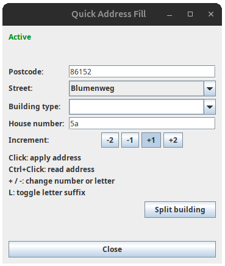

# QuickAddressFill

JOSM plugin for quickly applying address tags to buildings.

A simple mouse click is all it takes.


## Features

- Opens a dialog with `Postcode`, `Street`, optional `Building type`, `House number`, and increment selection (`-2`, `-1`, `+1`, `+2`).
- Activates a map mode where a left-click on a building sets the following tags:
  - `addr:street`
  - `addr:postcode` (if filled)
  - `building` (if building type is filled)
  - `addr:housenumber` (if filled)
- Automatically increments the house number after successfully applying tags, using the selected increment.
- Building type is single-use: if filled, it is applied on the next successful building click and then cleared in the dialog.
- Shows an overwrite warning for `addr:street` and `addr:postcode`.
- For house numbers containing letters (for example `12a`), the letter part is incremented (`12a` -> `12b`) instead of the numeric part.
- If a letter-based house number is entered while `+2` or a negative increment is selected, the dialog automatically switches increment back to `+1`.
- `+` increases the current house number component by one (number or letter, depending on the current value).
- `-` decreases the current house number component by one (number or letter, depending on the current value).
- `L` toggles a letter suffix on the house number (`12` <-> `12a`) for quick switching between numeric and lettered values.
- `Ctrl` + left-click on a building reads `addr:street`, `addr:postcode`, and `addr:housenumber` into the dialog (building type is not imported by pickup).
- `Ctrl` + left-click on a street (without a building hit) reads the nearby street `name` into the dialog street field and sets house number to `1`.
- Status line displays active values and updates continuously (street, postcode, house number, increment), including `QAF PAUSED` when mode is inactive.

## BuildingSplitter Integration

- QuickAddressFill can optionally work with the `BuildingSplitter` plugin.
- If available, the dialog shows a `Split building` button.
- If not loaded, the dialog shows `Building Splitter: not found`.
- After starting split mode, QuickAddressFill returns automatically to the address tool when splitting mode is left.

## Usage

1. Start `Quick Address Fill` in JOSM.
2. Select a street; optionally enter postcode, building type, and a starting house number.
3. Select increment (`-2`, `-1`, `+1`, `+2`).
4. Optional: use `Ctrl` + left-click on a building to read its address data into the dialog, or `Ctrl` + left-click on a street to pick its name.
5. Left-click buildings to apply tags.
6. Optional: press `+` to advance the current house number component by one.
7. Optional: press `-` to reduce the current house number component by one.
8. Optional: press `L` to toggle a trailing `a` suffix on/off.
9. Press `ESC` to pause/exit Street Mode (you can continue from the dialog).




## Build

```bash
ant compile
ant dist
```

## Local Installation

```bash
mkdir -p ~/.josm/plugins
cp dist/QuickAddressFill.jar ~/.josm/plugins/
```

## Translation Workflow

- Extraction source list: `i18n/POTFILES.in`
- Translation catalogs folder: `i18n/po/`
- POT template output: `i18n/po/templates/QuickAddressFill.pot`
- Generated `.lang` files: `i18n/lang/`

Create the first translation file (example):

- copy `i18n/po/templates/QuickAddressFill.pot` to `i18n/po/de.po`
- translate entries in `i18n/po/de.po`

Run extraction:

`ant i18n-extract`

Merge existing `.po` files with updated template:

`ant i18n-merge`

Generate JOSM `.lang` files from `.po` files:

`ant i18n-lang`

Run the full i18n workflow:

`ant i18n`

Build and package plugin (includes generated `.lang` files):

`ant dist`

`ant dist` packages files from `i18n/lang/` into `data/QuickAddressFill/lang/` inside the plugin JAR.

Prerequisite for `.po -> .lang` conversion:

- `perl` installed
- JOSM conversion script `i18n.pl` available at `i18n/i18n.pl`, or passed via `-Di18n.pl=/path/to/i18n.pl`
