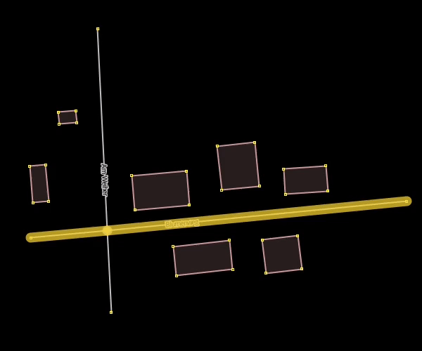
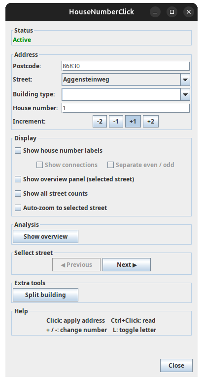

# HouseNumberClick

HouseNumberClick is a JOSM plugin for fast, street-focused house-number tagging on buildings.

## Documentation

- Class inventory (including core-class markers): `docs/class-inventory.md`

## What's New in 1.1.8

- Added persistent right-sidebar workflows with `Street Counts` and `House Numbers` dialogs (ToggleDialog-based, synchronized with plugin state).
- Added safer dialog lifecycle handling for dataset/layer transitions (pause on layer loss, safe resume, and reload when active dataset is replaced).
- Added persistent advanced dialog behavior (collapsible advanced sections + restored dialog bounds with off-screen fallback).
- Expanded postcode analysis to a three-state cycle (off -> buildings -> schematic areas) with deterministic legend/color behavior.
- Added country-aware address flow (`addr:country` detection/readback/apply with constrained country selection in the dialog).
- Refined dialog and split UI ergonomics (inline street navigation arrows, side-by-side split sections, equal split panel heights, clarified sidebar titles).

## Who This Is For

- Mappers who assign many addresses on one street in a focused workflow.
- Users who want fast apply/readback behavior with optional visual analysis overlays.

## Compatibility

- Java: **17+** (build uses `javac --release 17`).
- JOSM minimum main version: `19481` (see `Plugin-Mainversion` in `build.xml`).

## Demo



## Core Features

- Working dialog with `Street`, `Postcode`, `House number`, optional `City`, optional `Building type`, and increment (`-2`, `-1`, `+1`, `+2`).
- Postcode is selected from detected values in the current area (dropdown), but manual entry is also possible for new values.
- Postcode must be set before apply; empty postcode blocks address apply to reduce accidental wrong tagging.
- Left-click applies `addr:street`, `addr:postcode`, optional `addr:housenumber`, optional `addr:city` (when set), and optional `building=*`.
- House number auto-advances after successful apply, including suffix handling (`12a -> 12b`).
- `Ctrl+Click` reads existing address values from buildings, including `addr:city`; if no building is hit, nearby street name can be read.
- Conflict warning protects against unintended overwrite of existing address data, including city conflicts.
- Optional `Auto-zoom to selected street` zooms to mapped house-number buildings of the selected street.
- `Numbered only` (next to Auto-zoom) controls zoom scope: when enabled, auto-zoom targets only buildings with `addr:housenumber`; when disabled, full selected-street framing is used.
- The `HouseNumberClick` action follows JOSM tool behavior: it is enabled only while an editable data layer/dataset is available.

## Split and Row-House Tools

- Hold `Alt`, then press the left mouse button, drag a line across one building, and release to attempt a line split.
- Hold `Alt` and right-click a building to split it into row-house `Parts` configured in the dialog.
- No preselection is required; the target building is resolved directly from the drag or click.
- `Make rectangular` can orthogonalize line-split results after a successful split.
- Split actions are handled temporarily within Street Mode; there is no separate split mode.

## Map Mode Shortcuts

- `+` / `-`: change current house-number component.
- `L`: toggle suffix (`12 <-> 12a`).
- `Alt+1..9`: set number of parts.
- `Ctrl+Right click`: remove `addr:*` tags from clicked building.
- `Esc`: leave/pause Street Mode.
- `Ctrl+Shift+Click`: passed through to JOSM core shortcuts (no plugin readback).

## Split Controls

- **Temporary line split:** hold `Alt`, press the left mouse button, drag, and release to attempt a split.
- Releasing `Alt` cancels an ongoing split gesture (if not yet completed).
- **Split building:** hold `Alt`, then left-click and drag inside one building.
- **Row-house split:** hold `Alt` and right-click inside a building in Street Mode to split to row houses.
- **Parts quick-set:** press `Alt+1..9` in Street Mode to set number of parts.

## Power User Workflow

HouseNumberClick is designed for high-speed mapping with minimal context switching.

Instead of switching tools or modes, all core actions are available directly on the map:

- **Left-click**: apply address
- **Ctrl + Left click**: read address
- **Ctrl + Right click**: remove address tags
- **Alt + Left click + Drag**: split building
- **Alt + Right click**: split to row houses
- **Alt + 1..9**: set number of parts

This means you can:

- continue mapping without leaving Street Mode
- fix building geometry exactly at the moment you need it
- immediately resume assigning house numbers after a split
- avoid moving the mouse back and forth between map and dialog

### Example flow

1. Click buildings to assign house numbers
2. Encounter a building that needs splitting
3. Hold `Alt`, then left-click and drag -> split building
4. Release and continue clicking -> assign numbers
5. For row houses: hold `Alt` and right-click -> split to row houses, then continue mapping

No tool switching. No modal dialogs. No interruption of flow.

### Why this matters

Traditional workflows require:

- selecting a separate tool
- performing the split
- switching back to the address tool

HouseNumberClick removes these steps and keeps everything in a single continuous interaction loop.

This significantly reduces friction when mapping long streets or dense residential areas.

## Optional Visual Tools

- `Show house number labels`: overlay of house numbers for the selected street.
- `Show connection lines`: connects mapped numbers in sorted order; `Separate even / odd` splits parity paths.
- Overlay labels/lines are street-local and distance-limited: addressed buildings are considered when their computed label point is near the selected street chain (currently up to about 400 m).
- Duplicate house numbers are highlighted in the selected-street overlay using `street+postcode+housenumber` (local check, city is intentionally ignored).
- `House Numbers (Base Numbers only)` sidebar dialog: odd/even table with gap markers (`•` for missing base numbers); table click zooms to target object(s).
- `Street Counts (House Numbers)` sidebar dialog: list of all known streets and current counts; row click zooms to selected street. Duplicate marker `(dup)` follows the same conditional city rule as `Show duplicates`.
- `Show completeness` / `Hide completeness`: `Completeness overview` layer:
  - `... present` for the selected completeness focus (bright blue),
  - `... missing` for the selected completeness focus (bright orange),
  - `No Address Data` (gray, intentionally less prominent for buildings without street/postcode/housenumber).
- Completeness focus can be switched between `Number`, `Street`, `Postcode`, `City`, and `All`.
- `Show All Postcodes` / `Hide All Postcodes`: postcode overview layer:
  - bright pink = no postcode,
  - same color = same postcode,
  - postcode colors are deterministic (stable across hide/show).
- Completeness and postcode overview layers are mutually exclusive: enabling one hides the other.


## Usage

1. Start  `HouseNumberClick` in JOSM.
2. Select street and set postcode (from list or manual input), then set house number and optional city/building type.
3. Click buildings to apply addresses. House number increments automatically after each successful click.
4. Optional: use split interactions (`Alt+Left click+Drag` split building, `Alt+Right click` split to row houses, `Alt+1..9` set number of parts) for geometry workflows.
5. Use shortcuts plus optional sidebar dialogs and analysis layers as needed.



## Troubleshooting

- **No postcode selected:** choose a postcode from the dropdown or type one manually; apply is blocked while postcode is empty.
- **Tool button is disabled:** ensure an editable OSM data layer is loaded and active in JOSM.
- **No building detected:** zoom in and click directly on a closed `building=*` object.
- **Expected label/line is missing:** verify `addr:street` exactly matches the selected street and the building is within the selected-street overlay distance scope.
- **Overwrite warning appears:** existing address values differ (street/postcode/city/building); confirm to overwrite or cancel to keep existing tags. Street, postcode, and city can each be suppressed independently for repeated warnings.
- **Line split does not run:** draw the line so it clearly crosses one building (not only touching one edge/corner).
- **Line split fails with multiple targets:** avoid crossing two buildings; touching another building edge can still work, but crossing two buildings cannot be resolved uniquely.
- **Create row houses fails:** ensure `Parts >= 2` and click inside a closed `building=*` geometry.
- **Unexpected click failure:** retry once and check JOSM log output if the status line says address click failed.

## Build and Test

```bash
ant clean
ant test
ant dist
```

Artifacts:
- Main plugin jar: `dist/HouseNumberClick.jar`
- Versioned release jar: `dist/HouseNumberClick-<version>.jar` (via `ant release-artifact`)

## Local Installation

```bash
mkdir -p ~/.josm/plugins
cp dist/HouseNumberClick.jar ~/.josm/plugins/
```

## PluginsSource-First Release (GitHub Hosted Jar)

1. Set release version in `build.xml` (`plugin.version`).
2. Build release artifacts:

```bash
ant clean
ant test
ant release-artifact
```

If `i18n/i18n.pl` is missing locally and you need `.lang` generation from `po/*.po`, run with an explicit override:

```bash
ant -Di18n.pl=/path/to/i18n.pl release-artifact
```

3. Commit release changes and create an annotated Git tag `v<version>`.
4. Push `main` and push tag `v<version>`; GitHub Actions (`.github/workflows/release.yml`) publishes/updates the release automatically.
5. For PluginsSource, use the direct GitHub release asset URL pattern:
   - `https://github.com/<owner>/<repo>/releases/download/v<version>/HouseNumberClick-<version>.jar`

## License

GNU General Public License v2. See `LICENSE`.
